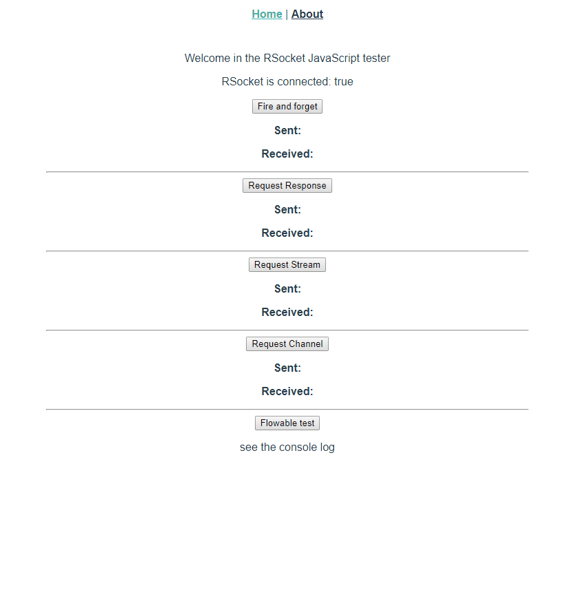

# Soyez réactif avec RSocket (Reactive Socket) - Jug Summer Camp 2020

Vous pouvez retrouver les slides de la présentation dans le repertoire presentation ou [ici](./presentation/RSocket%20-%20Jug%20Summer%20Camp%202020%20-%20AWATTEZ.pdf)

Ce projet contient deux parties:
- java
- js

## Java

Il s'agit de démontrer l'ensemble des interactions et possibilités qu'offre le protocole RSocket et ce de maniére simple.
Vous trouverez plus de précision dans le `README.md` du projet java.

La finalité de cette démonstration est l'usage de Spring pour démarrer un serveur basé sur le protocole RSocket et qui utilise une WebSocket comme couche de transport.
```
ws://localhost:7000
```

## JS

Projet Vue.js principalement inspiré du blog [KojotDev](http://kojotdev.com/2019/09/rsocket-examples-java-javascript-spring-webflux/)  
Dans le fichier `Home.vue`, l'url de la WebSocket est configuré.

 
 
 Ce projet utilise [`rsocket-js`](https://github.com/rsocket/rsocket-js):
```
rsocket-core
rsocket-flowable
rsocket-websocket-client
```


# Documentations et liens utilisés

- https://rsocket.io/ 
- https://grapeup.com/blog/reactive-service-to-service-communication-with-rsocket-introduction/
- https://github.com/linux-china/awesome-rsocket
- https://www.reactivemanifesto.org/fr
- https://github.com/rsocket 
- https://github.com/rsocket/rsocket-js
- https://github.com/rsocket/rsocket-java

