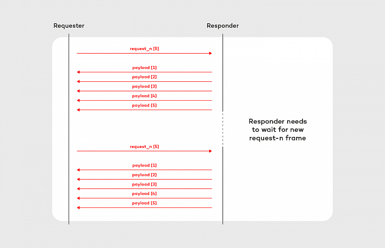
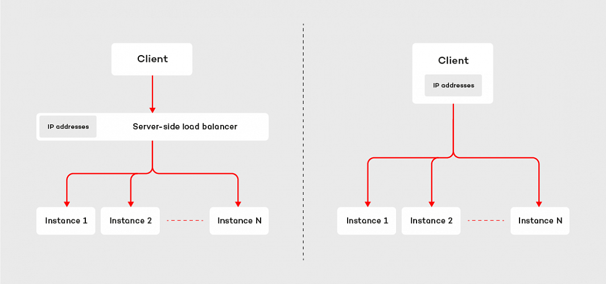

# Pour commencer

### Starter
Le projets a été demarré à l'aide de https://start.spring.io/ en version `2.2.9.RELEASE`.  
La version de RSocket Java est figée `<rsocket.version>1.0.1</rsocket.version>`.

Cependant les premiers exemples n'utilisent pas Spring.

### Les logs 
Vous pouvez modifier les niveaux de logs à l'aide du fichier `src/main/resources/logback.xml`.

Le logger `io.rsocket.FrameLogger` est trés utile pour debugger.

## Interactions
`fr.jug.summersocket.interaction` deux serveurs sont presents dans le sous-package `server`.  

- *Fire-and-Forget* : requête unique, pas de réponse envoyée par le serveur
- *Request/Response* : « HTTP-like » : 1 requête, 1 réponse.
- *Request/Stream* : requête simple, réponse multiple. Le serveur renvoie une collection (stream) en réponse. Ce n’est pas une liste figée mais bien un flux qui arrive au fil de l’eau.
- *Channel* : échanges bi-directionnels. Les 2 participants s’envoient des flux de messages l’un à l’autre.

## contre pression (Back-Pressure)
`fr.jug.summersocket.backpressure`. Encore une fois vous retrouverez un package `client` et `server`, l'illustration ci-dessous démontre le concept:  
 

## Repartisseur de charge (Load-Balancer)

`fr.jug.summersocket.loadbalancer`. Encore une fois vous retrouverez un package `client` et `server`, ici on démarre plusieurs serveurs `7000, 7001, 7002`.  

L'illustration ci-dessous démontre le concept:  
 


Ne pas oublier l'ajout de la dépendance suivante:
```
<dependency>
    <groupId>io.rsocket</groupId>
    <artifactId>rsocket-load-balancer</artifactId>
    <version>${rsocket.version}</version>
</dependency>
```

## Reprise de connexion/traitement (Resumability)
cf. `fr/jug/summersocket/resume/README.md`

---

Vous pouvez trouver plus d'informations ci-dessous:
- https://grapeup.com/blog/reactive-service-to-service-communication-with-rsocket-introduction/
- https://github.com/rsocket/rsocket-java/tree/master/rsocket-examples (*attention à la version de RSocket*)

